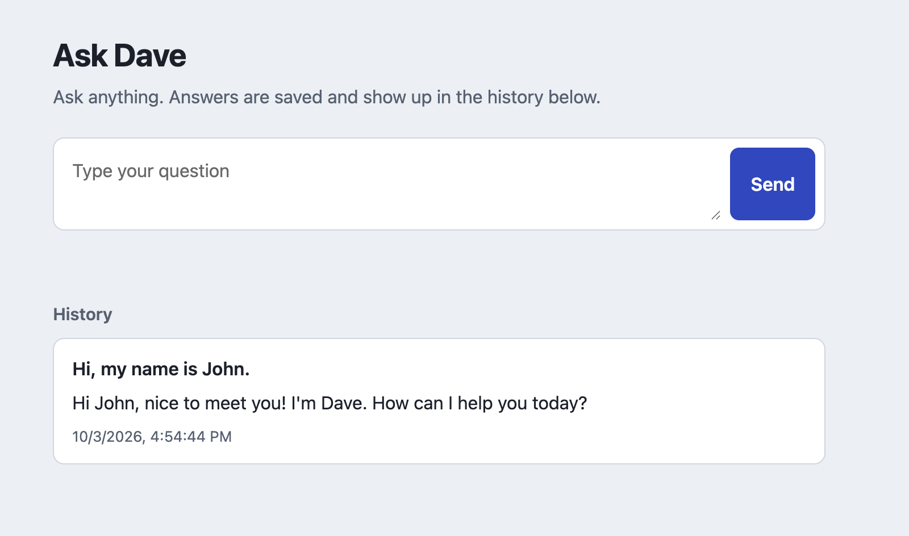
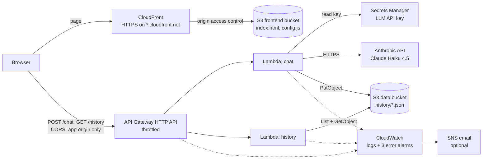

# AskDave

AskDave is a small AI chat tool on AWS. You ask a question in a web page, Claude answers, and every question and answer is saved and shown in a history list. Everything is created by Terraform with one command and removed with another, in any AWS account, with no manual steps.

<p align="center">
  
</p>

- **Requirements:** [docs/requirements.md](docs/requirements.md)
- **Full reasoning behind every decision:** [docs/architecture-decisions.md](docs/architecture-decisions.md)

## Prerequisites

- **Git**, to clone the repository.
- **Terraform 1.11 or newer.** On macOS: `brew install hashicorp/tap/terraform`.
- **AWS credentials** for an IAM user or role allowed to create the resources below (for example, `AdministratorAccess` in a sandbox account), available through the standard credential chain: `aws configure`, `AWS_PROFILE`, or SSO. Avoid root user access keys.
- **An Anthropic API key** with credits, from [platform.claude.com](https://platform.claude.com). Setting a monthly spend limit on its workspace is strongly recommended: it is the real cap on LLM cost.
- **Python 3 and curl,** preinstalled on macOS and most Linux distributions, used by the scripts' checks and summaries.
- **The AWS CLI** (recommended): the deploy script uses it to show which account it's deploying into, and the test scripts and the post-destroy check need it.

## Deploy

1. **Get the code** and change into its folder. All commands below run from there.

   ```bash
   git clone https://github.com/lsilvapvt/ask-dave-prototype.git
   cd ask-dave-prototype
   ```

   With SSH keys set up on GitHub, `git clone git@github.com:lsilvapvt/ask-dave-prototype.git` works too.


2. **Load your Anthropic API key into the terminal session.** Run this command:

   ```bash
   read -rs TF_VAR_llm_api_key && export TF_VAR_llm_api_key
   ```

   The terminal then waits on an empty line, with no prompt. Paste the key (Cmd+V on macOS, Ctrl+Shift+V in most Linux terminals) and press Enter. Nothing appears while you paste; that's intentional, so the key isn't shown on screen or saved in your shell history. To confirm it was captured without revealing it, `echo ${#TF_VAR_llm_api_key}` prints its length, which should be well above zero.


3. **Deploy from the same terminal window:**

   ```bash
   ./scripts/deploy.sh
   ```

   The key lives only in that terminal session. In a new window, `cd` into the folder and repeat step 2 first.


Prefer a prompt? Skip step 2: when `TF_VAR_llm_api_key` isn't set, `deploy.sh` asks "Anthropic API key (input hidden):" and you paste the key there instead.

The script checks the Terraform version, shows which AWS identity and region it is deploying into, applies the stack, and prints the app URL at the end. A first deploy takes about 3-5 minutes, mostly CloudFront publishing the site. Open the URL as soon as the command finishes.

The key goes straight to AWS Secrets Manager: it is never written to the repo, to Terraform state or plan files, or to a Lambda environment variable.

Defaults: region `us-east-1`, model Claude Haiku 4.5. See [Configuration](#configuration) to change them.

## Destroy

```bash
./scripts/destroy.sh
```

Destroy doesn't need the LLM key. It removes everything, including buckets that still hold files and the secret (deleted immediately, not scheduled for deletion). It then runs `scripts/verify-destroyed.sh`, which searches the account for anything still belonging to this project and fails if it finds something. Destroy also takes about 3-5 minutes, because CloudFront must be disabled before it can be deleted; that's expected, not a hang.

## Architecture



**Loading the page.** The browser fetches `index.html` and `config.js` from CloudFront over HTTPS. The bucket behind it is private: only this one CloudFront distribution can read it. `config.js` is generated by Terraform with the live API URL, which is how the page finds the backend with no manual wiring. `index.html` is the provided page, uploaded byte for byte.

**Asking a question.** The page sends `POST /chat` with `{"prompt": "..."}` to API Gateway, which only accepts browser calls from the app's own CloudFront address. The `chat` function reads the Anthropic key from Secrets Manager (cached for five minutes), asks Claude, saves `{prompt, response, timestamp}` as a new S3 object named `history/<timestamp>_<uuid>.json`, and returns it.

**Showing history.** The page then calls `GET /history`. The `history` function lists the saved objects, sorts their names newest first (the timestamp leads the name, so name order is time order), reads the newest 50 in parallel, and returns them as a list.

**Watching it.** Each function and the API log to their own CloudWatch log groups. Three alarms fire on any error: one per function, and one on the API's 5xx responses. Email notifications are optional.

## Decisions and why

The short version; each point is argued in full in [docs/architecture-decisions.md](docs/architecture-decisions.md).

- **Serverless, so idle cost is near zero.** Lambda, API Gateway, CloudFront and S3 bill per request. Idle, the stack costs well under $1 a month (see [Cost](#cost)). Containers or EC2 would bill around the clock.
- **Two functions, two IAM roles.** `chat` can read the one key secret and add history entries, nothing else; it can't read or list history. `history` can only read history; it can't touch the secret. Both write only to their own log group, with no permission to create log groups. These boundaries were checked with the IAM policy simulator.
- **The LLM key never leaves Secrets Manager.** The Lambda environment holds only the secret's ARN. The key enters Terraform as an ephemeral variable feeding a write-only argument, so it isn't stored in Terraform state either; that was checked after every deploy.
- **Anthropic's API directly, not Amazon Bedrock.** The deployer brings their own API key. Bedrock authenticates through IAM, so there would be no key to protect, and it usually needs a manual model-access form per account.
- **Claude Haiku 4.5 by default, for cost and speed:** about a quarter of a cent and 1-3 seconds per typical answer. Switching to Sonnet or Opus is one variable.
- **No dependencies to package.** The functions use only Python's standard library plus the boto3 that the Lambda runtime ships; the LLM is called over HTTPS with `urllib`. Terraform zips the code itself, so there is no build step.
- **One S3 object per question, never a shared file.** A single growing `history.json` would lose answers when two requests overlap (read, modify, write). Separate, timestamp-named objects can't collide and sort newest first by name.
- **CloudFront with a private bucket.** It's the only way to get HTTPS with no domain, certificate or DNS setup, so the app works the moment deploy finishes.
- **Failures are loud.** Handlers don't turn LLM or S3 failures into friendly 500 responses; they let them raise, so Lambda counts them and the alarms fire. Bad input gets a 400 and never alarms.
- **Rate limiting, not basic auth, as the abuse control.** The provided page calls the API on another domain and can't be changed, so a browser would never send login credentials to the API. Throttling protects the API directly.
- **Destroy leaves nothing behind**, enforced by tests: buckets are force-destroyed, the secret skips its recovery window, and log groups are created by Terraform rather than by Lambda (a log group Lambda creates itself survives `terraform destroy`).

## What would break first at 1,000 users

In the order they would hit:

1. **Lambda concurrency in a new account.** New AWS accounts often allow only 10 concurrent Lambda executions. Each chat holds one for the length of the LLM call, so about ten simultaneous questions fill it, and the API starts answering 503. This happened in testing: 30 parallel requests got 503s and the API alarm fired. *Change:* request a quota increase (1,000 is the usual default), then raise the throttle limits to match.
2. **The throttle, by design.** `POST /chat` allows 1 request per second sustained, shared by all users, so most of 1,000 users would see "Too Many Requests". *Change:* raise it with the concurrency, and add per-user limits, which need user identity or an AWS WAF rate rule per IP.
3. **Anthropic's own rate limits** per organization tier. *Change:* a higher tier, plus a queue so bursts wait instead of failing.
4. **History reads every key on every page load** and shows everyone's questions to everyone. *Change:* DynamoDB with a timestamp sort key for paginated newest-first queries, and per-session history.
5. **Cost exposure without auth.** Throttling caps the rate, not the bill: 1 request per second is roughly $200 a day of Haiku at worst. *Change:* always set an Anthropic workspace spend limit; then add auth.
6. **Synchronous answers** must finish inside API Gateway's 30-second limit. Fine for Haiku's 1-3 seconds, risky for larger models. *Change:* stream responses or use an async job pattern.

## What I'd do next with another week

- **Conversation memory per browser session.** Today the model sees only the current question, so "My name is John" followed by "What is my name?" gets no recall. The page can't be changed to send a session ID, so: route `/chat` and `/history` through CloudFront on the page's own domain, which lets the browser carry a session cookie; save entries under `history/<session>/...`; and send each session's last ~10 exchanges as context.
- **Basic authentication for both the page and the API.** A CloudFront Function checks the credentials at the edge. The same same-origin routing is needed so the browser sends the credentials to the API too, plus a secret header from CloudFront so the direct API Gateway URL can't bypass the login. Building it with conversation memory shares that routing work.
- **DynamoDB for history**, for paginated newest-first queries that don't read every key.
- **Streaming or async answers**, so slow responses never hit the 30-second limit and the page can show text as it arrives.
- **Remote Terraform state and a CI `terraform plan`.** Both need resources that outlive this stack (a state bucket, an OIDC role), so they belong in a small separate bootstrap stack.
- **More LLM providers** (for example, OpenAI): a provider variable with per-provider request adapters, because auth, request and response formats all differ.

## Configuration

All optional, set as environment variables before `./scripts/deploy.sh` (for example, `export TF_VAR_llm_model=claude-sonnet-5-5`).

| Variable | Default | What it does |
|---|---|---|
| `TF_VAR_aws_region` | `us-east-1` | Region to deploy into. |
| `TF_VAR_project_name` | `ask-dave` | Name prefix; a random suffix keeps names unique. |
| `TF_VAR_llm_model` | `claude-haiku-4-5` | Anthropic model. `claude-sonnet-5-5` and `claude-opus-5-5` give stronger, costlier answers. |
| `TF_VAR_llm_max_tokens` | `1024` | Longest answer, in tokens. Caps cost per question. |
| `TF_VAR_max_prompt_chars` | `4000` | Longest accepted question. Longer ones get HTTP 400. |
| `TF_VAR_history_limit` | `50` | How many recent entries the page shows. |
| `TF_VAR_chat_rate_limit` / `TF_VAR_chat_burst_limit` | `1` / `5` | Throttle for `POST /chat`, requests per second / burst. |
| `TF_VAR_api_rate_limit` / `TF_VAR_api_burst_limit` | `10` / `10` | Throttle for other routes. |
| `TF_VAR_alarm_email` | empty | Email for alarm notifications. AWS sends a confirmation link that must be clicked once. |
| `TF_VAR_log_retention_days` | `14` | How long CloudWatch keeps logs. |
| `TF_VAR_llm_api_key_version` | `1` | Increase it to push a new key: Terraform can't see a changed key by itself, because it never stores it. |

To change the key: export the new one, set `TF_VAR_llm_api_key_version=2` (then 3, and so on), and deploy again.

## Testing

**After deploying:**

```bash
./scripts/smoke-test.sh   # 36 checks against the live stack
./scripts/test-alarm.sh   # injects one real error and waits for the alarm to fire (1-3 minutes)
```

The smoke test checks, among other things, that the page is served byte for byte, plain HTTP redirects to HTTPS, buckets refuse direct access, CORS refuses other websites, history comes back newest first, a real question gets a real answer that appears in history, bad requests get 400, rapid requests get 429, the key isn't in Terraform state, and no alarm is firing. It asks the model one short question (a fraction of a cent) and removes everything it adds.

`test-alarm.sh` calls the chat function directly with a request shape API Gateway never sends, which raises a real error; nothing is saved and the LLM isn't called. The alarm returns to OK on its own several minutes later.

**Without deploying.** Every push runs [.github/workflows/ci.yml](.github/workflows/ci.yml), which needs no AWS credentials. The same checks run locally:

```bash
./scripts/setup-dev.sh   # once: Python tools into .venv and .venv-checkov
./scripts/check.sh       # terraform fmt and validate, tflint, ruff, pytest, checkov, gitleaks, shellcheck
```

The pytest suite has unit tests for both functions (no network or AWS: S3, Secrets Manager and Anthropic are faked) and guard tests that read the Terraform and the repo. The guard tests enforce the project's rules: `index.html` is unmodified; no account IDs, ARNs, keys or tfvars files are committed; the key flows only into the write-only secret; each function has its own role, and the roles allow exactly what they should; everything can be destroyed; every function has an alarm; the API is throttled; CloudFront is HTTPS-only. Checkov's security findings that are deliberately accepted (for example, no customer-managed KMS keys, which cost about $1 a month each even idle) are suppressed next to the resource with a one-line reason.

## Cost

| | Monthly when idle | Per question |
|---|---|---|
| Secrets Manager secret | $0.40 | ~$0.000005 per key fetch, cached 5 minutes |
| CloudWatch alarms (3) | $0.30, or free within the free tier's 10 alarms | none |
| S3, CloudFront, API Gateway, Lambda | about $0 (pay per request) | fractions of a hundredth of a cent |
| Anthropic, Claude Haiku 4.5 | $0 | about $0.0025 for a typical question and answer |

## Repository layout

```
backend/chat/handler.py       POST /chat
backend/history/handler.py    GET /history
frontend/index.html           the provided page, never edited
frontend/config.js.tmpl       rendered by Terraform with the live API URL
infra/                        Terraform, one file per concern: storage, secrets, iam, lambda, api, cloudfront, alarms
scripts/                      deploy, destroy, smoke-test, test-alarm, verify-destroyed, check, setup-dev
tests/                        unit tests and guard tests (pytest)
docs/                         requirements and architecture decisions
images/                       README screenshot
```

---

## Troubleshooting

**Deploy fails with "Your account must be verified before you can add new CloudFront resources".** This is an account-level hold from AWS, not a problem with the code; it can affect new accounts, especially after several CloudFront distributions are created and deleted in a short time. Open a free AWS Support case (Support, Create case, "Account and billing"), paste the full error message, and deploy again once AWS confirms. Meanwhile, `./scripts/destroy.sh` removes the resources the partial deploy did create.

---